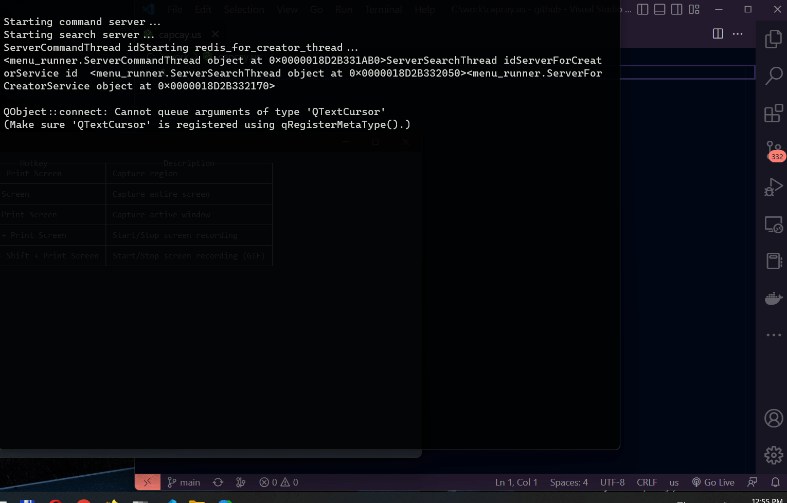
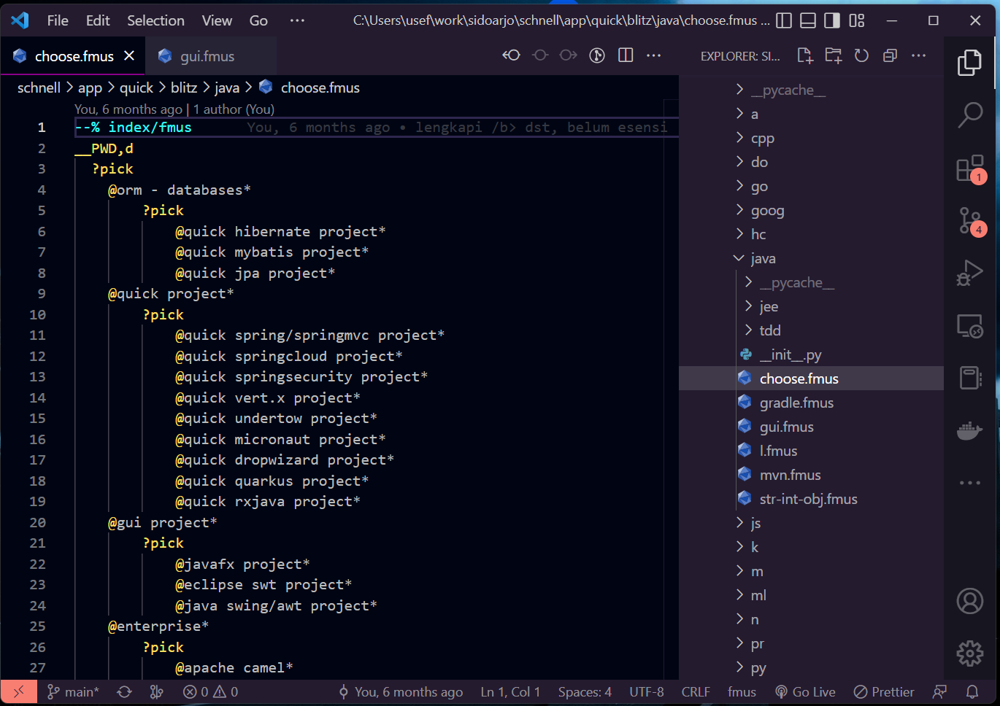

# Vscode extension for Repl language

Replang vscode extension is an extension to work with Replang server.

Replang server contains a Redis Pubsub which will listen for request on a channel (A) and send the response back to a different channel (B).

This vscode extension will publish to channel (A) and subscribe to channel (B).

In the following screenshot, we can type any replang code (fM, ff, f@c, fl, /pattern-to-search etc) and they will be replaced by the response given by the server.



# Vscode extension for Fmus language

- Provide resources for Fmus language family (Fmus, fm, us, mk)
- Highlight language elements of Fmus language family (region start/stop, branching/looping statements, command statement, special statement etc.)



## textmate grammar
```
comment
  comment.block
  comment.block.documentation
  comment.line
constant
  constant.character.escape
  constant.language
  constant.numeric
  constant.other
  constant.other.placeholder
  constant.numeric
  constant.numeric.integer
  constant.numeric.integer.binary
  constant.numeric.integer.octal
  constant.numeric.integer.decimal
  constant.numeric.integer.hexadecimal
  constant.numeric.integer.other
  constant.numeric.float
  constant.numeric.float.binary
  constant.numeric.float.octal
  constant.numeric.float.decimal
  constant.numeric.float.hexadecimal
  constant.numeric.float.other
  constant.numeric.complex
  constant.numeric.complex.real
  constant.numeric.complex.imaginary
entity
  entity.name
  entity.name.class
  entity.name.struct
  entity.name.enum
  entity.name.union
  entity.name.trait
  entity.name.interface
  entity.name.impl
  entity.name.type
  entity.name.class.forward-decl
  entity.name.constant
  entity.name.function
  entity.name.function.constructor
  entity.name.function.destructor
  entity.name.label
  entity.name.namespace
  entity.name.section
  entity.name.tag
  entity.other.attribute-name
  entity.other.inherited-class
invalid
  invalid.deprecated
  invalid.illegal
keyword
  keyword.control
  keyword.control.conditional
  keyword.control.import
  keyword.declaration
  keyword.operator
  keyword.operator.assignment
  keyword.operator.arithmetic
  keyword.operator.bitwise
  keyword.operator.logical
  keyword.operator.word
  keyword.other
markup
  markup.bold
  markup.deleted
  markup.heading
  markup.inserted
  markup.italic
  markup.list.unnumbered
  markup.list.numbered
  markup.other
  markup.quote
  markup.raw.block
  markup.raw.inline
  markup.underline
  markup.underline.link
meta
  meta.annotation
  meta.annotation.identifier
  meta.annotation.parameters
  meta.class
  meta.struct
  meta.enum
  meta.union
  meta.trait
  meta.interface
  meta.impl
  meta.type
  meta.block
  meta.braces
  meta.brackets
  meta.function
  meta.function-call
  meta.function.parameters
  meta.function.return-type
  meta.generic
  meta.group
  meta.interpolation
  meta.namespace
  meta.paragraph
  meta.parens
  meta.path
  meta.preprocessor
  meta.string
  meta.tag
  meta.toc-list
punctuation
  punctuation.definition.annotation
  punctuation.definition.comment
  punctuation.definition.variable
  punctuation.definition.string.begin
  punctuation.definition.string.end
  punctuation.section.interpolation.begin
  punctuation.section.interpolation.end
  punctuation.accessor
  punctuation.separator
  punctuation.accessor.continuation
  punctuation.terminator
  punctuation.definition.generic.begin
  punctuation.definition.generic.end
  punctuation.section.brackets.begin
  punctuation.section.brackets.end
  punctuation.section.group.begin
  punctuation.section.group.end
  punctuation.section.parens.begin
  punctuation.section.parens.end
  punctuation.section.braces.begin
  punctuation.section.braces.end
  punctuation.section.block.begin
  punctuation.section.block.end
source
storage
  storage.modifier
  storage.type
  storage.type.class keyword.declaration.class
  storage.type.struct keyword.declaration.struct
  storage.type.enum keyword.declaration.enum
  storage.type.union keyword.declaration.union
  storage.type.trait keyword.declaration.trait
  storage.type.interface keyword.declaration.interface
  storage.type.impl keyword.declaration.impl
  storage.type keyword.declaration.type
  storage.type.function keyword.declaration.function
string
  string.quoted.double
  string.quoted.single
  string.quoted.triple
  string.regexp  
  string.unquoted
support
  support.class
  support.constant
  support.function
  support.module
  support.type
text
  text.html
  text.xml
variable
  variable.annotation
  variable.function
  variable.language
  variable.other
  variable.other.constant
  variable.other.member
  variable.other.readwrite
  variable.parameter
  variable.function
```
